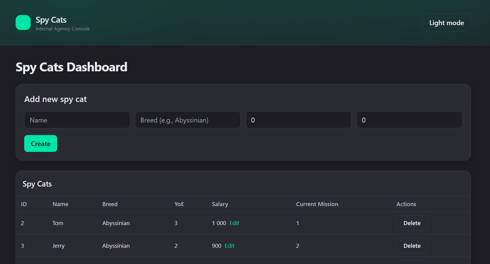
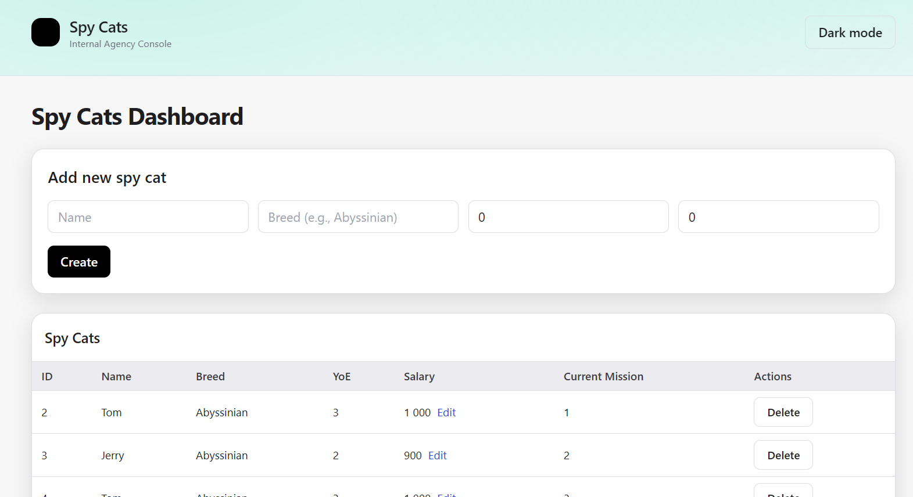

# 🐱 Spy Cat Agency — Fullstack Application

# This is only FE part

# Only BE part -> https://github.com/RoomToom/sca-backend

A fullstack CRUD application for the **Spy Cat Agency (SCA)**. The project demonstrates backend development with **FastAPI** and a frontend dashboard built with **Next.js + TailwindCSS**.

-----

## 📂 Project Structure

```
.
├── app/ # Backend (FastAPI, Python)
│ ├── api/routers # Routers for cats, missions, targets
│ ├── models # SQLAlchemy models
│ ├── schemas # Pydantic schemas
│ ├── services # Business logic
│ └── tests # Pytest test suite (unit + e2e)
│
├── src/ # Frontend (Next.js + Tailwind)
│ ├── app/_components # UI components (Navbar, Tables, Forms, Alerts)
│ ├── pages # Pages Router (index.tsx, _app.tsx, _document.tsx)
│ └── lib/api.ts # API integration with backend
│
├── sca.db # SQLite database
├── postman_collection.json # Postman collection (full test coverage)
├── requirements.txt # Python dependencies
├── package.json # Node.js dependencies
├── dockerfile # Backend Dockerfile
├── Dockerfile.frontend # Frontend Dockerfile
└── docker-compose.yml # Combined orchestration
```

-----

## ⚙️ Backend (FastAPI)

### Features

  * **Spy Cats**
      * Create, list, get, update salary, delete
      * Breed validation using [TheCatAPI](https://api.thecatapi.com/v1/breeds)
  * **Missions & Targets**
      * Create missions with 1–3 targets
      * Assign cats to missions (one active mission per cat)
      * Update target notes (blocked when complete)
      * Mark targets complete (mission auto-completes when all done)
      * Delete missions (only if not assigned)
      * List & get missions
  * **Validation & errors**
      * Proper HTTP codes: 200, 201, 204, 400, 404, 422
  * **Testing**
      * Unit + e2e tests with `pytest`
      * Full Postman collection (positive & negative cases)

### Run locally

```bash
python -m venv .venv && source .venv/bin/activate  # or .venv\Scripts\activate on Windows
pip install -r requirements.txt

# optional: add TheCatAPI key
echo "CAT_API_KEY=your_api_key" > .env

uvicorn app.main:app --reload --port 8000
```

API: http://localhost:8000

#### Run tests

```bash
pytest -q
```

-----

## 💻 Frontend (Next.js)

### Features

  * **Spy Cats dashboard:**
      * List cats
      * Create new cat
      * Edit salary inline
      * Delete cat
  * Handles API errors gracefully (e.g., 422 invalid breed)
  * Clean dark/light theme in “secret agency” style
  * Responsive layout (Tailwind)

### Run locally

```bash
cd src
npm install
npm run dev
```

Frontend: http://localhost:3000

Make sure the backend is running on port 8000.
Configure API URL in `src/.env.local`:

```ini
NEXT_PUBLIC_API_URL=http://localhost:8000
```

-----

## 🧪 Postman Tests

Import `https://raw.githubusercontent.com/RoomToom/sca-backend/refs/heads/master/postman_collection.json` into Postman.
Run the collection — all tests (cats, missions, targets, validations) should pass.

-----

Backend → http://localhost:8000
Frontend → http://localhost:3000

### Backend only

```bash
docker build -t sca-backend -f dockerfile .
docker run -p 8000:8000 sca-backend
```

### Frontend only

```bash
docker build -t sca-frontend -f Dockerfile.frontend ./src
docker run -p 3000:3000 sca-frontend
```

-----

## ✅ Requirements covered (per test task)

### Backend

  * REST API with FastAPI ✅
  * SQLite DB ✅
  * CRUD for cats ✅
  * Missions with targets, validation rules ✅
  * Validation with TheCatAPI ✅
  * Pytest tests ✅
  * Postman collection with positive & negative cases ✅

### Frontend

  * Spy Cats dashboard in Next.js ✅
  * CRUD for cats ✅
  * Error handling ✅
  * TailwindCSS styling (dark/light theme) ✅

-----

## 📸 Screenshots

### Dark Mode


### Light Mode


-----

## ✉️ Notes

  * Missions/targets are backend-only (per requirements).
  * Field “Current Mission” in the UI shows the assigned mission id if present.
  * Database is stored in `sca.db`. Remove it to reset state.
